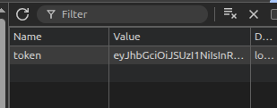
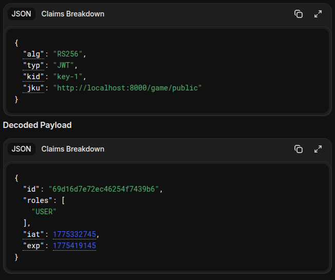

# Flappy Write-up

## JWT jku Injection → Получение ADMIN-панели

**Сервис:** Игровой сервер «FLAPPY» с JWT-авторизацией  

**Уязвимость:** Доверие заголовку `jku` и смешивание алгоритмов RS256/HS256  

**Результат:** Подделка JWT → доступ к админ‑панели и флагу

> [!NOTE]
>
> ### Райтап на собственный сервис
> Write‑up покажет эксплуатацию намеренно внесённой уязвимости в моём первом проекте!
> Ознакомиться с архитектурой, кодом и самими сервисом => [Flappy – JWT jku Injection Demo](https://github.com/Vitl-DevSec/WebDevelop/tree/main/Projects/Flappy)

> **Не повторяйте это на реальных серверах** – Проект создан в обучающих целях

---

## 1 шаг: Разведка

---

- Регистрируемся и заходим посмотреть, что у нас лежит в cookie

  

---

- Замечаем, что сервис нам выдал jwt токен, проверим что в нем содержится на сайте jwt.io

  

- Замечаем, что алгоритм подписи `RS256`, публичный ключ для проверки сервер берет из своего же эндпоинта (но просто взять публичный ключ не получается, сервер проверяет секретные заголовки для доступа к эндпоинту `/game/public`). Также видим, что нам выдало роль `USER`, значит вероятно есть роль `ADMIN`

---

## 2 шаг: Эксплуатация уязвимости

---

> [!TIP]
>
> ### Идея
> Подменить ссылку в jku на свою (со своим ключем), поменять алгоритм с `RS256`(работающий с приватным ключем подписи и публичным ключем проверки) на `HS256` (где используется один и тот же ключ для подписи и проверки), поставить себе роль `ADMIN` и подписать токен ключем из своей ссылки 

- Пробуем подменить ссылку на скачивание ключа на свою, оставив там свой ключ